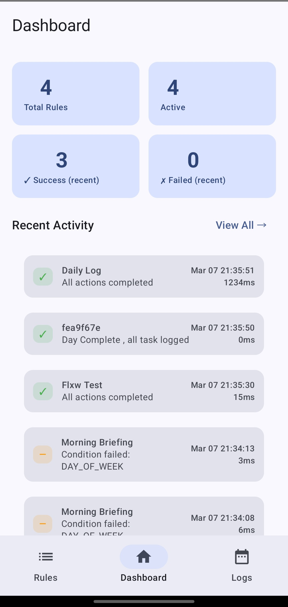
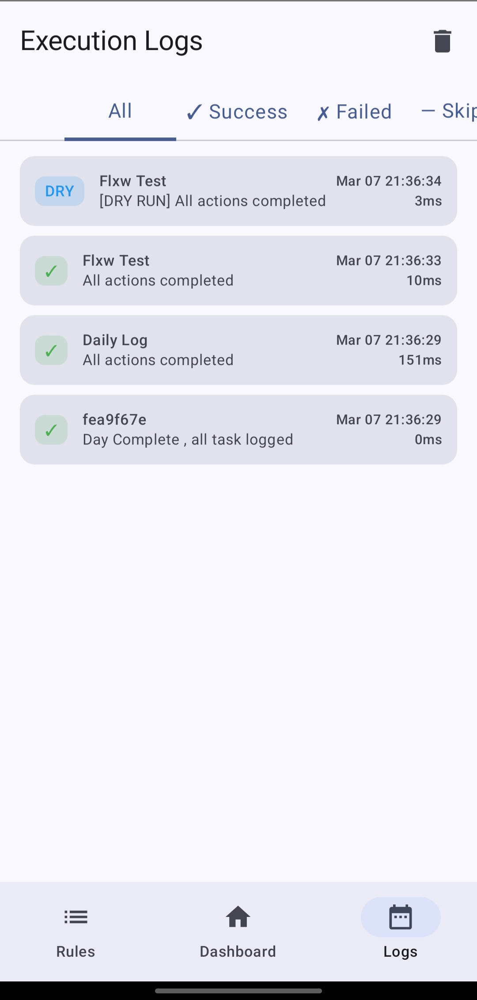
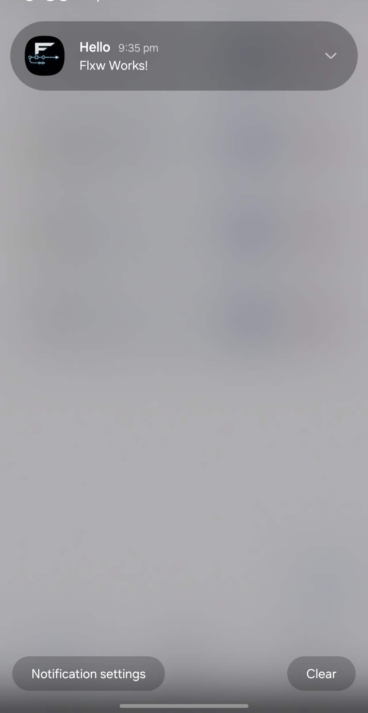

# Flxw — Personal Automation Engine

> A powerful Android automation app that runs rules silently in the background , even when the app is closed.

---

## What is Flxw?

Flxw lets you create automation rules that fire automatically on a schedule. Each rule has three parts:

- **WHEN** — a trigger (time, interval, or manual)
- **IF** — optional conditions (day of week, time range, last run)
- **DO** — actions (notification, log, webhook)

Once a rule is saved and enabled, you never need to open the app again.

---

## Screenshots

| Dashboard | Logs |
|---|---|
|  |  |

| Rule Creation | Rule Wizard |
|---|---|
|  |  |

| Rule Detail | Notification |
|---|---|
|  |  |

> 

---

## Features

### Triggers
| Trigger | Description |
|---|---|
| ⏰ Time | Fires daily at a specific HH:MM |
| 🔁 Interval | Fires every N minutes (min 15) |
| 👆 Manual | Fires on demand via Run Now |

### Conditions
| Condition | Description |
|---|---|
| Time Range | Only run between two times |
| Day of Week | Only run on selected days |
| Last Run | Only run if not fired in N minutes |

### Actions
| Action | Description |
|---|---|
| 🔔 Notification | Posts local push notification |
| 📝 Log Message | Writes to execution log |
| 🌐 Webhook POST | Sends HTTP POST to a URL |

### Bonus Features
- 📊 Execution Log Viewer with status filters
- 🔢 Rule Priority (1–10)
- ⚠️ Conflict Detection
- 📤 JSON Export — share rules as .json file
- 📥 JSON Import — restore rules from .json
- 🧪 Sandbox / Dry Run mode
- 🔄 Auto-reschedule after device reboot

---

## Tech Stack

| Technology | Version | Role |
|---|---|---|
| Kotlin | 2.0 | Primary language |
| Jetpack Compose | 1.6 | All UI screens |
| Room | 2.6 | SQLite persistence |
| WorkManager | 2.9 | Background scheduling |
| Hilt | 2.50 | Dependency injection |
| Ktor Client | 2.3 | Webhook HTTP POST |
| kotlinx.serialization | 1.6 | JSON encode/decode |
| Compose Navigation | 2.7 | Screen routing |

---

## Architecture

Clean MVVM with 5 layers:
```
UI Layer          →  Compose Screens
ViewModel Layer   →  RuleViewModel, LogViewModel, DashboardViewModel
Repository Layer  →  RuleRepository, LogRepository
Engine Layer      →  RuleEngine, ConditionEvaluator, ActionDispatcher
Data Layer        →  Room DAOs, SQLite Entities
```

Background execution flow:
```
WorkManager tick
    → ScheduledRuleWorker.doWork()
    → RuleEngine.evaluate()
    → ConditionEvaluator.allPass()
    → ActionDispatcher.run()
    → LogRepository.insert()
```

---

## Setup

### Requirements
- Android Studio Hedgehog or later
- JDK 17
- Android device or emulator (API 26+)

### Run locally
```bash
git clone [https://github.com/YOUR_USERNAME/flxw-automation.git](https://github.com/git-parth-ch/Flxw-Personal-Automation-Engine.git)
cd flxw-automation
./gradlew assembleDebug
adb install app/build/outputs/apk/debug/app-debug.apk
```

---

## Download

👉 [Download latest APK](https://github.com/git-parth-ch/Flxw-Personal-Automation-App/releases/tag/v1.0)

---

## Known Limitations

- **15-minute minimum interval** — Android platform constraint enforced by WorkManager
- **Doze mode delays** — triggers may be delayed up to 10 minutes when screen is off
- **iOS not supported** — Android only in this version. KMP planned for future
- **No webhook retry** — failed webhook calls are logged but not retried

---

## Minimum SDK

- **Min SDK: API 26** (Android 8.0 Oreo) — covers ~95% of active devices
- **Target SDK: API 34** (Android 14)
